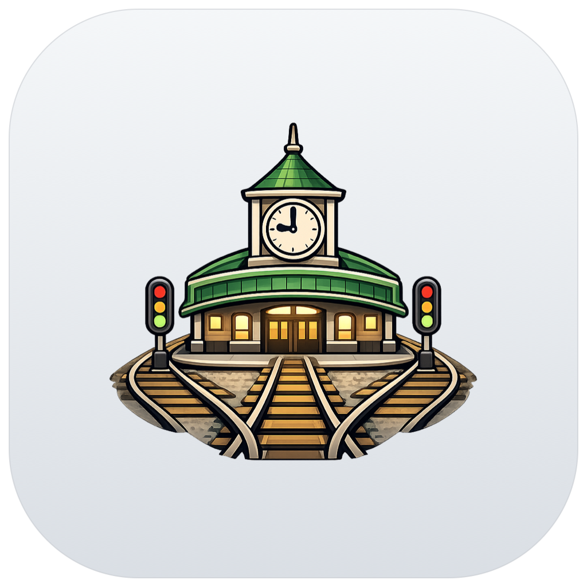
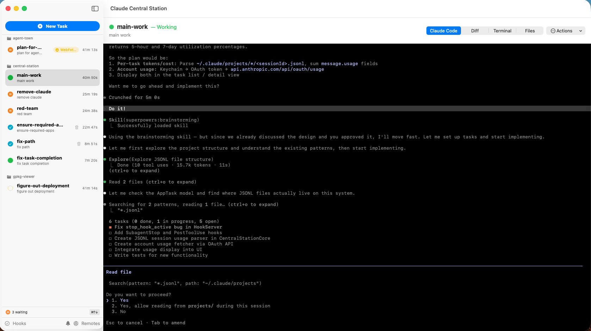

<p align="center">
  
</p>

# Central Station

A multi-agent, multi-repo command center for Claude Code. Run multiple Claude Code instances across repos, each in its own git worktree, and monitor them all from a single native macOS dashboard.

Unlike wrapper tools that simulate agents, Central Station uses **native Claude Code installations**. Every agent gets the full, unmodified Claude Code harness — tool use, file editing, MCP servers, permissions, hooks, voice control, remote control, and every other native feature — with a dashboard that shows you what's happening across all of them. A lightweight localhost hook server lets Claude Code notify the dashboard when it needs input, so you never miss a prompt.

**Full Claude Code compatibility** is the key differentiator. Because Central Station embeds real Claude Code sessions rather than reimplementing them, every native feature works out of the box — including voice mode, remote control, custom slash commands, and MCP server integrations. When Anthropic ships new capabilities, they just work.

<p align="center">
  
</p>

## Philosophy: Worktrees or Bust

Central Station is opinionated. It firmly believes that all agent-driven development should happen in git worktrees — isolated branches where agents can build, test, and even push PRs without stepping on each other or on your working copy.

If you're not ready to adopt worktrees, Central Station probably isn't for you. But if you are, this is a preview of how autonomous agents should operate: each one gets a clean workspace, works independently, runs tests, creates pull requests, and reports back — all without blocking you or any other agent.

## Features

### Built-in Diff Viewer

Review file changes made by each agent directly in the dashboard. Every task's detail view includes a diff tab showing exactly what the agent has modified, so you can audit changes without switching to a separate tool.

### Embedded Terminal

Each task includes a fully interactive terminal running the actual Claude Code session. Watch agents work in real time, respond to prompts, or take over manually — all without leaving the dashboard.

### File Browser

Browse the worktree file tree for any task from the Files tab. Quickly inspect the current state of files an agent is working on without navigating to the directory yourself.

### VS Code Launcher

Open any task's worktree directly in VS Code with a single click. Jump from monitoring in the dashboard to hands-on editing when you need to intervene or continue work manually.

### Cost Tracking

Monitor API spend per task and across all running agents. The dashboard tracks token usage and cost in real time, so you always know what your fleet of agents is costing you.

### Full Native Claude Code Support

Voice control, remote control, MCP servers, custom slash commands, hooks, permissions — every Claude Code feature works because Central Station runs real Claude Code sessions, not a reimplementation.

## Install

Requires macOS 14+ and Swift 6.0+ (Xcode or Command Line Tools).

**One-liner:**

```sh
curl -fsSL https://raw.githubusercontent.com/jgodwin-ai/central-station/main/install.sh | sh
```

This clones the repo, builds a release binary, installs `Claude Central Station.app` to `/Applications`, and adds a `central-station` CLI command.

**From source:**

```sh
git clone https://github.com/jgodwin-ai/central-station.git
cd central-station
scripts/build-dmg.sh 1.0.0   # produces build/Claude Central Station-1.0.0.dmg
```

**Usage:**

```sh
# Launch from anywhere
central-station

# Or with a task config
central-station tasks.yaml
```

## Architecture

Central Station is a native SwiftUI macOS app. Here's how the pieces fit together:

```
┌─────────────────────────────────────────────────┐
│  Dashboard (SwiftUI)                            │
│  ┌───────────┐ ┌─────────────────────────────┐  │
│  │ Task List │ │ Detail: Claude | Diff |      │  │
│  │           │ │         Terminal | Files     │  │
│  └───────────┘ └─────────────────────────────┘  │
└──────────────────────┬──────────────────────────┘
                       │
              ┌────────┴────────┐
              │  Hook Server    │  (localhost HTTP)
              │  :19280         │
              └────────┬────────┘
                       │ POST /hook/stop
        ┌──────────────┼──────────────┐
        ▼              ▼              ▼
  ┌──────────┐   ┌──────────┐   ┌──────────┐
  │ Claude   │   │ Claude   │   │ Claude   │
  │ Code #1  │   │ Code #2  │   │ Code #3  │
  │ worktree │   │ worktree │   │ worktree │
  └──────────┘   └──────────┘   └──────────┘
```

**Git worktrees** — Each task gets its own worktree (`<project>/.worktrees/<task-id>`) on a dedicated branch. Agents work in isolation; merge back to main when done.

**Hook server** — A local HTTP server receives Claude Code `Stop` hook events. When an agent finishes a turn and is waiting for input, the hook fires a POST to the dashboard, updating task status in real time. No polling.

**Embedded terminals** — Each task has a terminal tab running the actual Claude Code session. You can also pop it out or open the worktree in VS Code.

## Disclaimer

This is an independent, community project. It is **not** an official Anthropic product and is not affiliated with or endorsed by Anthropic in any way. This software is provided as-is with no warranty of any kind — use at your own risk. See [LICENSE](LICENSE) for details.

## License

[MIT](LICENSE)
